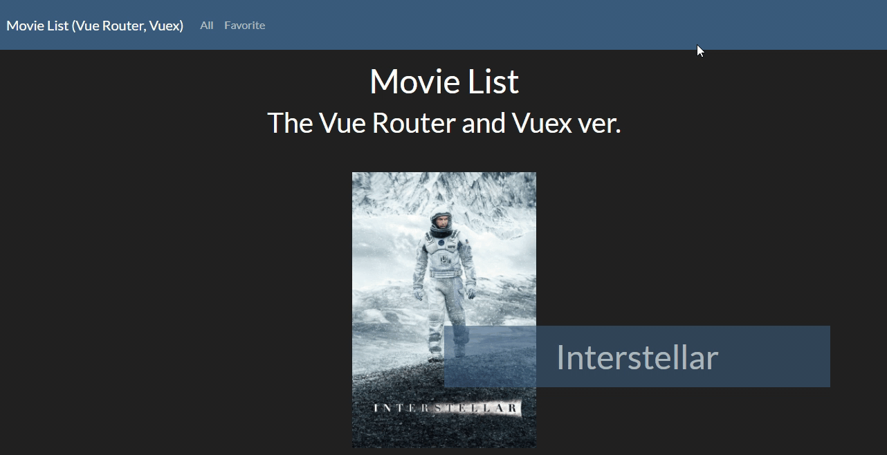

# Movie List: The Vue Router and Vuex ver.

展示網址：https://tzynwang.github.io/vue-movie-list/

## 參考文件
- [Vuex: Call an action from within another action](https://stackoverflow.com/questions/45848974/call-an-action-from-within-another-action)
- [Vuex: How to pass an argument to functions mapped using …mapActions(…)?](https://stackoverflow.com/questions/40910831/how-to-pass-an-argument-to-functions-mapped-using-mapactions)